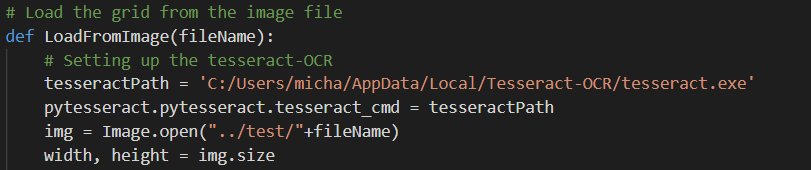

# Sudoku Solver

<p align="center">
    

## Latar Belakang
Anda adalah Mr. Khun, saat ini Anda tergabung bersama tim Sweet & Sour untuk mencapai puncak menara. Agar dapat mencapai puncak menara, ada harus melalui serangkaian tes untuk dapat naik ke lantai selanjutnya. Saat ini Anda berada di lantai 18 dan administrator lantai tersebut, yaitu Mr. Le Leo ingin sekali menguji kecerdasan tim Anda dalam membuat strategi. Area permainan pada lantai ini dibagi menjadi 81 area, berbentuk seperti matriks berukuran 9x9. Setiap area ditandai dengan angka, dalam satu kolom maupun satu baris tidak boleh ada angka berulang (seperti pada permainan sudoku). Untuk lolos dari tes ini, tim Anda harus mengumpulkan kristal yang ada pada area bernomor 5. Anda yang bertugas sebagai light bearer (bertugas mengawasi seluruh area permainan dan memberikan petunjuk serta menyusun strategi untuk seluruh anggota tim). Anda bisa berkomunikasi dengan seluruh anggota dan melihat seluruh area permainan melalui lighthouse, tugas Anda adalah mencari tahu nomor untuk semua area permainan dan memberitahukan koordinat (x,y) area-area yang ditandai dengan nomor 5 kepada anggota tim Anda.

### Checklist Program
- [X] Program dibuat dalam bahasa Python
- [X] Program menerima input berupa file eksternal
- [X] Program melengkapi area-area yang nomornya belum diketahui
- [X] Hasil penyelesaian disimpan dalam file eksternal
- [X] Menuliskan koordinat dari area bernomor 5 pada cmd / file eksternal
- [X] Membaca input berupa gambar
- [X] Program diletakkan di src, file pengujian di test, hasil pengujian berupa screenshot di result
- [X] Program dikerjakan secara Individu dan mencantumkan referensi

### Strategi Pencarian Solusi
Algoritma yang digunakan dalam penyelesaian Sudoku adalah algoritma **Backtracking**. Alasan penggunaan algoritma Backtracking sendiri adalah karena prinsip dan cara kerja dari algoritma ini menurut saya cukup pintar dan logis seperti cara bermain sudoku yang sebenarnya. Pengisian sudoku memanfaatkan rules dari permainan Sudoku itu sendiri, yaitu memastikan setiap angka yang diisi merupakan angka yang unik pada satu kolom, satu baris, dan satu sub-grid tempat pengisian tersebut. Program akan melakukan iterasi seluruh area terurut dari atas ke bawah untuk pengisian setiap area. Apabila hasil pengisian mentok pada titik tertentu, pengisian akan dirunut-balik (undo) ke pengisian sebelumnya dengan mengganti dengan angka yang lain.

Selain itu, algoritma backtracking juga efisien untuk penyelesaian Sudoku pada kasus rata-rata. Untuk kompleksitas algoritma backtracking pada Sudoku, kompleksitas waktu yang diperlukan adalah O(9^(n*n)). Kompleksitas waktu tersebut diperoleh mengingat banyaknya opsi pemilihan angka dari 1-9 untuk setiap area / cell pada matrix 9x9 (NxN). Sedangkan kompleksitas ruang yang diperlukan adalah O(n^n) untuk menyimpan grid sudoku dalam sebuah matrix.

### Library Pengerjaan Bonus
Dalam pengerjaan bonus, berikut ini adalah beberapa library yang digunakan dalam menunjang pemrosesan gambar sudoku ke dalam program.
- **Tesseract**<br>
  Library ini digunakan untuk melakukan pengekstrakan data dari suatu gambar ke dalam string (Optical Character Recognizition)<br>
  - *Kelebihan (+)* :<br>
    Pengekstrakan data bisa dilakukan dengan cepat dan penulisan kode relatif lebih mudah (cukup 1 baris saja)<br>
  - *Kekurangan (-)*:<br>
    Hasil ekstraksi terlalu detail sehingga pola-pola pada gambar seperti garis, kotak, atau gambar yang tidak beraturan juga ikut diekstrak menjadi simbol-simbol yang mendekatinya. Selain itu, instalasi library tesseract juga agak merumitkan dibandingkan library python lainnya.<br>
- **Pillow (PIL)**<br>
  Library ini digunakan untuk melakukan pengolahan terhadap gambar yang diinput. Pengolahan tersebut dapat berupa pemotongan gambar (cropping) dengan tujuan agar hasil ekstrak data dari gambar bisa menjadi lebih akurat.<br>
  - *Kelebihan (+)* :<br>
    Pengolahan gambar yang lebih mudah mengingat method-method yang disediakan mudah dipahami dan mudah penggunaannya.<br>
  - *Kekurangan (-)*:<br>
    Pengolahan gambar mungkin tidak sedetail dengan OpenCV. Gambar yang digunakan dalam pengekstrakan harus *straightforward* (langsung pada inti gambar yang ingin diolah).<br>
- **Regular Expression**<br>
  Library ini digunakan untuk menghapus character-character non-numerik dari hasil pengekstrakan data.<br>
  - *Kelebihan (+)* :<br>
    Penghapusan character lebih mudah dan cepat<br>
  - *Kekurangan (-)*:<br>
    Perlu mempelajari tata cara dan grammar tertentu dalam regular expression<br>

## Getting Started
Instruksi-instruksi berikut ini akan membimbing Anda dalam tahap instalasi aplikasi dan cara menjalankannya.

### Prerequisites
Berikut ini adalah persiapan environment yang dibutuhkan untuk menjalankan aplikasi.
- Python 3.x.x untuk bahasa pemrograman aplikasi
- Pillow (PIL) untuk pemrosesan gambar menjadi matriks
- Tesseract-OCR untuk pengekstrakan data dari gambar

### Installing
Berikut ini adalah langkah-langkah dalam penginstallan aplikasi:
1. Install library pillow terlebih dahulu menggunakan command sebagai berikut.
  ```
  pip install pillow
  ```
2. Install Tesseract dengan mengunduh installer pada laman berikut ini.
  ```
  https://sourceforge.net/projects/tesseract-ocr/
  ```
3. Agar tesseract dapat digunakan dalam program python, lakukan penginstallan library PyTesseract dengan menjalankan command berikut ini.
  ```
  pip install pytesseract
  ```
4. Pada source code ./src/reader.py, ubah path dari tesseract sesuai dengan lokasi penginstallan Tesseract dilakukan. Sebagai contoh, pengembang menginstall tesseract pada directory berikut ini.
  ```
  C:/Users/micha/AppData/Local/Tesseract-OCR/tesseract.exe
  ```
  Oleh karena itu, path tesseract pada `./src/reader.py` diubah secara manual dengan mengisikan path diatas sebagai berikut.
  <p align="center">
      

5. Semua prerequisites sudah disiapkan dengan baik.

## How to Run Program
Untuk menjalankan program, pastikan command sudah berada dalam directory `./src`, lalu jalankan command sebagai berikut.
```
python main.py
```

## Guideline: How to Use
1. Masukkan pilihan metode pengambilan grid sudoku. Terdapat dua pilihan, yaitu pengambilan dari gambar dan pengambilan dari text file
2. Siapkan file-file gambar atau text file untuk dijadikan sebagai bahan untuk pengambilan gambar sudoku. Pastikan bahwa file-file tersebut disimpan pada `./test`
3. Masukkan nama file yang ingin diproses pada perintah input nama file pada aplikasi.
4. Program akan menampilkan grid sudoku awal, bila sudah yakin dengan grid sudoku tersebut, lanjutkan prosedur.
5. Tunggu dalam beberapa saat selama grid sudoku diselesaikan oleh program.
6. Hasil penyelesaian sudoku akan ditampilkan pada layar dan disimpan pada file eksternal pada `./src` dengan nama yang sama dengan nama file.
7. Selamat! Sudoku Puzzle sudah diselesaikan.

Catatan: Tidak semua sudoku puzzle bisa diselesaikan.

## Built With
* [Python](https://www.python.org/) - Bahasa pemrograman utama aplikasi
* [Tesseract](https://github.com/tesseract-ocr/) - Kakas pengekstrakan data

## Referensi
1. Sudoku Solver with Backtracking: https://www.geeksforgeeks.org/sudoku-backtracking-7/
2. Implement A Sudoku Solver: https://www.youtube.com/watch?v=JzONv5kaPJM&
3. Algoritma Runut-Balik (Backtracking): https://informatika.stei.itb.ac.id/~rinaldi.munir/Stmik/2017-2018/Algoritma-Runut-balik-(2018).pdf
4. Pillow Tutorial: https://pillow.readthedocs.io/en/4.1.x/handbook/tutorial.html
5. How to split image into small blocks: https://answers.opencv.org/question/173852/how-to-split-image-into-small-blocks-process-on-them-and-then-join-all-the-blocks-together-again/

## Author
**13518056 - Michael Hans** - *Designer, Programmer, and Tester*

## Acknowledgements
* Asisten IRK, Nada Afra Sabrina